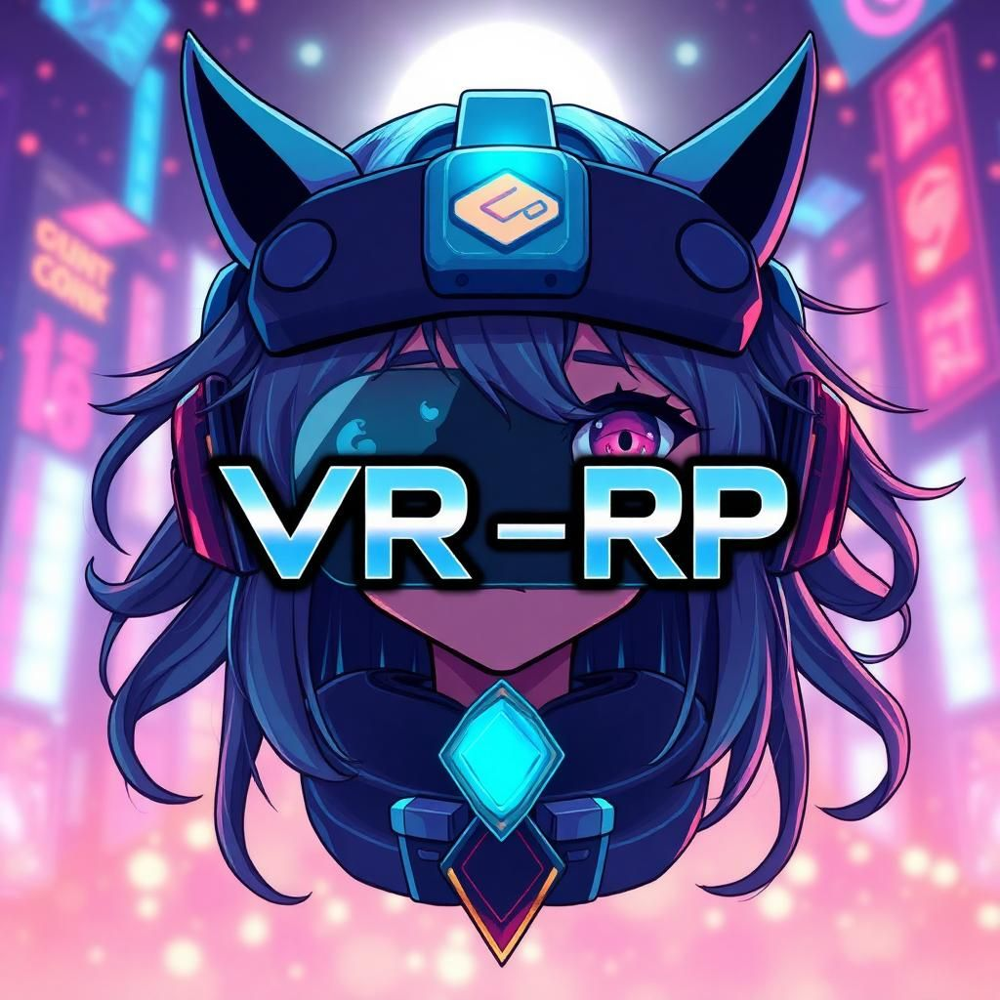

# VR-RP - Virtual Reality Role-Playing Platform



## Overview

VR-RP is the ultimate Virtual Reality Role-Playing platform that combines cutting-edge AI technology with immersive VR experiences. Built for self-hosting, it allows you to run your own VR-RP server on your personal computer with complete control over your data and experiences.

## ✨ Features

- **🎮 VR-Ready**: Full virtual reality support with haptic feedback and spatial audio
- **🤖 AI-Powered Characters**: Interact with intelligent NPCs using OpenAI, Claude, or Gemini
- **👥 Multiplayer Support**: Join friends in shared virtual worlds
- **🎭 Role-Playing Modes**: Casual, RP, and RPG gameplay modes
- **🏠 Self-Hosted**: Run on your own PC with complete privacy and control
- **🎨 Customizable**: Create unique characters, personas, and worlds
- **🌐 Modern Web Tech**: Built with React, FastAPI, and MongoDB

## 🚀 Quick Start

### Prerequisites

- **Node.js** 16+ and **Yarn**
- **Python** 3.11+
- **MongoDB** (local or Docker)
- **Docker** (optional, recommended)

### Installation

1. **Clone the Repository**
   ```bash
   git clone <your-repo-url>
   cd vr-rp
   ```

2. **Install Dependencies**
   ```bash
   # Frontend
   cd frontend
   yarn install
   
   # Backend
   cd ../backend
   pip install -r requirements.txt
   ```

3. **Environment Setup**
   ```bash
   # Backend environment
   cd backend
   cp .env.example .env
   # Edit .env with your settings
   
   # Frontend environment
   cd ../frontend
   cp .env.example .env
   # Edit .env with your backend URL
   ```

4. **Start the Application**
   ```bash
   # Start MongoDB (if local)
   mongod --dbpath /path/to/db
   
   # Start Backend
   cd backend
   uvicorn server:app --host 0.0.0.0 --port 8001 --reload
   
   # Start Frontend
   cd frontend
   yarn start
   ```

### Using Supervisor (Recommended for Production)

```bash
# Start all services
sudo supervisorctl restart all

# Check service status
sudo supervisorctl status
```

## 🔧 Configuration

### Backend (.env)
```env
MONGO_URL=mongodb://localhost:27017/vr_rp
OPENAI_API_KEY=your_openai_key
ANTHROPIC_API_KEY=your_anthropic_key
GEMINI_API_KEY=your_gemini_key
JWT_SECRET_KEY=your_jwt_secret
```

### Frontend (.env)
```env
REACT_APP_BACKEND_URL=http://localhost:8001
```

## 🌐 Self-Hosting

VR-RP is designed to be completely self-hosted on your own hardware:

- **Privacy First**: All your data stays on your local machine
- **Full Control**: Customize every aspect of your VR-RP instance
- **No Dependencies**: No external services required (except optional AI APIs)
- **Easy Deployment**: One-command Docker setup available

## 📱 Social Media Integration

The website is optimized for social sharing with proper meta tags:

- **Open Graph**: Facebook, LinkedIn sharing
- **Twitter Cards**: Optimized Twitter previews
- **SEO Optimized**: Search engine friendly
- **Custom Favicon**: Uses your VR-RP logo

## 🎭 Game Modes

- **Casual**: Natural conversations with AI characters
- **RP (Role-Playing)**: Immersive character roleplay experiences
- **RPG**: Game-style interactions with choices and consequences

## 🤖 AI Integration

Support for multiple AI providers:
- **OpenAI**: GPT-4, GPT-4o, O1 series
- **Anthropic**: Claude Sonnet, Opus, Haiku
- **Google**: Gemini 2.0 Flash and Pro models

## 🛠 Tech Stack

- **Frontend**: React 18, Tailwind CSS, Lucide Icons
- **Backend**: FastAPI, Python 3.11+
- **Database**: MongoDB
- **AI**: Multi-provider support via emergentintegrations
- **VR**: WebXR compatible
- **Deployment**: Docker, Supervisor

## 📸 Screenshots

The landing page features:
- Stunning VR-themed design with your anime character
- Smooth animations and modern UI
- Mobile-responsive layout
- Social media optimized sharing

## 🆘 Support

- **Documentation**: Check the `/docs` endpoint when running
- **Community**: Join our Discord community
- **Issues**: Create GitHub issues for bugs
- **Email**: support@vr-rp.app

## 📄 License

This project is licensed under the MIT License.

## 🚀 Roadmap

- [ ] Enhanced VR integration
- [ ] Voice chat capabilities
- [ ] Mobile app development
- [ ] Advanced multiplayer features
- [ ] Plugin system
- [ ] Cloud deployment options

---

**VR-RP** - Enter the Virtual Reality Role-Playing Universe 🌟

*Built with ❤️ for the VR community*